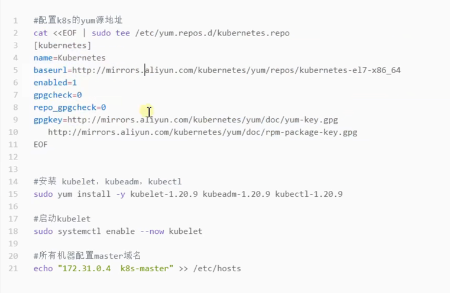
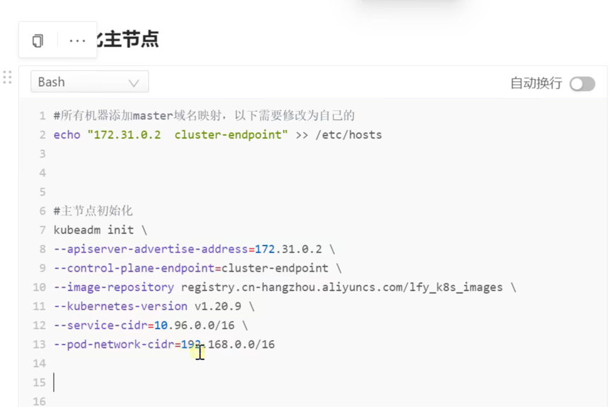
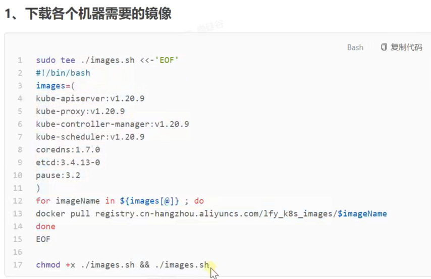

# 安装步骤

- 系统centos
- 配置：master（4C8G）node（8C16G）*2

## 1、安装docker

- 移除已安装的docker ：sudo yum remove docker*
- sudo yum install -y yum-utils
- sudo yum-config-manager --add-repo https://download.docker.com/linxu/centos/docker-ce.repo
- 指定版本：yum install -y docker-ce-20.10.7 docker-cli-20.10.7 containerd.io-1.4.6
- 最新版本：yum install -y docker-ce docker-cli containerd.io
- 开机启动docker： systemctl enable docker --now
- 配置docker：

```
sudo mkdir -p /etc/docker
sudo tee /etc/docker/daemon.json <<-'EOF'
{
  "registry-mirrors":["https://xxsxxo8z.mirror.aliyuncs.com"],
  "exec-opts":["native.cgroupdriver=systemd"],
  "log-driver:"json-file",
  "log-opts":{
    "max_size":"100m"
  },
  "storage-driver":""overlay2
}
EOF
sudo systemctl daemon-reload
sudo systemctl restart docker
```

## 2、安装kubernetes

#### 1、基本环境

- 设置主机名：hostnamectl set-hostname (名称)
- 查看交互分区：free -m
-
- 将selinux 设置为permissive （相当于将其禁用）
- sudo setenforce 0
- sudo sed -i 's/^SELINUX=enforcing$/SELINUX=permissive/' /etc/selinux/config
-
- 关闭swap分区
- sudo swapoff -a
- sudo sed -ri 's/.*swap.*/#&/' /etc/fstab

- 允许iptables 检查桥接流量

```
cat <<EOF | sudo tee /etc/modules-load.d/k8s.conf     
br_netfilter      
EOF   
cat <<EOF | sudo tee /etc/sysctl.d/k8s.conf   
net.bridge.bridge-nf-call-ip6ftables=1    
net.bridge.bridge-nf-call-ipftables=1     
EOF
sudo systctl --system
```

#### 2、安装 kubelet、kubeadm、kubectl



#### 3、初始化master节点

###### 1、初始化：主节点初始化，只需要在master上执行



###### 2、根据返回结果执行命令、记录关键信息

###### 3、安装calico网络插件

    - curl https://docs.projectcalico.org/manifests/calico.yaml -O
    - kubectl apply -f calico.yaml

#### 4、加入worknode节点

- kubectl join cluster-endpoint:6443 --token 。。。
- 创建新都令牌： kubectl token create --print-join-command
- 每秒看自动刷新看状态 watch -n 1 kubectl get pod -A

## 3、安装kubeSphere前置环境

### 1、nfs文件系统

###### 1、安装nfs-server

```
# 在每个机器
yum install -y nfs-utils

# 在master执行一下命令
echo "/nfs/data *(insecure,rw,sync,no_root_squash)" > /etc/exports

# 执行以下命令，启动nfs服务，创建共享目录
mkdir -p /nfs/data

# 在master执行
systemctl enable rpcbind
systemctl enable nfs-server
systemctl start rpcbind
systemctl start nfs-server

# 使配置生效
exportfs -r

# 检查配置是否生效
exportfs
```

###### 2、配置nfs-client（选做）

```
showmount -e 172.31.0.4(master机器的ip地址)
mkdir -p /nfs/data
mount -t nfs 172.31.0.4:/nfs/data /nfs/data
```

###### 3、配置默认存储

- yaml文件

### 2、metrics-server

- 集群指标监控组件

## 4、安装kubeSphere

- 下载配置文件
- 修改配置文件


#### 使用kubeadm 引导集群



### k8s 可视化页面

- dashboard
- 部署：kubectl apply -f https://raw.githubusercontect.com/kubernetes/dashboard/v2.3.1/aio/deploy/recommended.yaml
- 设置访问端口：kubectl edit svc kubernetes-dashboard -n kubernetes-dashboard
    - 将tyoe：ClusertIP 改为NodePort
    - kubectl get svc -A | grep kubernetes-dashboard

- 创建访问账号
- 获取访问令牌


